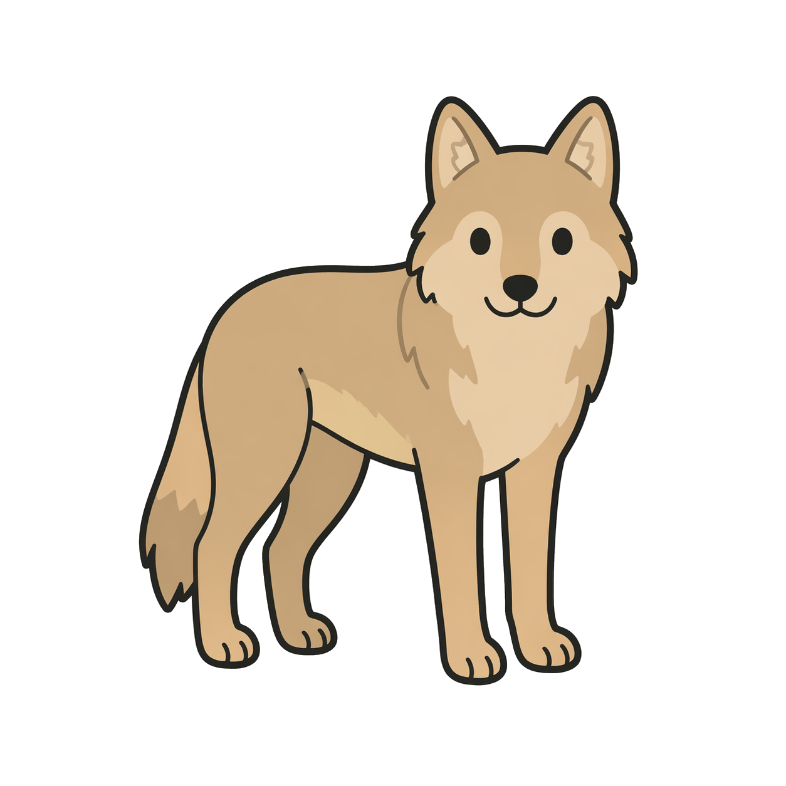

# 늑구 (Neukgu) — Clawd on Desk 테마

A cute cartoon wolf desktop pet theme for [Clawd on Desk](https://github.com/rullerzhou-afk/clawd-on-desk).

Idle 상태에 마우스 눈 추적 지원. Typing / Thinking / Happy 애니 포함.

## 🎬 미리보기

| idle (eye tracking) | thinking 🤔 | working 💻 | happy ✨ |
|:---:|:---:|:---:|:---:|
|  |  |  |  |

## 📦 설치

### 🚀 Quick install (추천)

```bash
git clone https://github.com/cola314/neukgu-clawd-theme
cd neukgu-clawd-theme
```

**Windows (PowerShell)**:
```powershell
./install.ps1
```

**macOS / Linux (bash)**:
```bash
chmod +x install.sh && ./install.sh
```

그 다음:
1. Clawd on Desk 재시작 (트레이에서 Quit → 다시 실행)
2. 우클릭 → **Theme** → **늑구 (Neukgu)** 선택

### 수동 설치

스크립트 안 쓸 경우:

```bash
# Windows
cp -r * "$APPDATA/clawd-on-desk/themes/neukgu/"
# PNG 참조 우회 (아래 기술적 메모 참조)
mkdir -p "$APPDATA/clawd-on-desk/theme-cache/neukgu/assets"
cp assets/idle-eyeless.png "$APPDATA/clawd-on-desk/theme-cache/neukgu/assets/"

# macOS
cp -r * "$HOME/Library/Application Support/clawd-on-desk/themes/neukgu/"
mkdir -p "$HOME/Library/Application Support/clawd-on-desk/theme-cache/neukgu/assets"
cp assets/idle-eyeless.png "$HOME/Library/Application Support/clawd-on-desk/theme-cache/neukgu/assets/"

# Linux
cp -r * "$HOME/.config/clawd-on-desk/themes/neukgu/"
mkdir -p "$HOME/.config/clawd-on-desk/theme-cache/neukgu/assets"
cp assets/idle-eyeless.png "$HOME/.config/clawd-on-desk/theme-cache/neukgu/assets/"
```

### ℹ️ PNG cache 복사가 왜 필요한가?

Clawd는 외부 테마 SVG를 보안상 sanitize해서 `theme-cache/` 로 분리하지만, 비-SVG 자산(PNG, APNG)은 원본 dir에 그대로 둡니다. idle-follow.svg의 `<image href="idle-eyeless.png">` 상대 경로가 cache dir 기준으로 resolve되어 PNG를 못 찾는 이슈가 있어, 설치 스크립트가 PNG도 cache로 복사해 우회합니다. 자세한 기술 배경은 [NOTES.md](NOTES.md) 참조.

## 🎨 상태 매핑

| 상태 | 트리거 | 애니 |
|------|-------|------|
| `idle` | 기본 | 정적 + 마우스 눈 추적 |
| `working` | PreToolUse (툴 실행) | 3프레임 타이핑 루프 |
| `thinking` | UserPromptSubmit (프롬프트 입력) | 3프레임 꼬리 흔들기 + 흰 "?" |
| `attention` | Stop (작업 완료) | 3프레임 cheer wave + 노란 스파클 |
| `sleeping` | 절전 | idle 폴백 (TODO) |
| `notification` / `error` | TODO | — |

## 🛠️ 커스터마이징 & 재생성

`scripts/`에 AI 생성 파이프라인 전체 포함:

- `gen-frame.py` — OpenRouter Nano Banana 호출 (승인 후 `--confirm`으로 실행)
- `transparent-bg.py` — border flood-fill로 흰 배경 투명화 + 갇힌 흰색 컬러 tint
- `align-frames.py` — bbox/ROI 기반 프레임 정렬 (흔들림 제거)
- `assemble-apng.py` — PIL로 APNG 합성
- `erase-eyes.py` — eye tracking용 PNG 눈 제거
- `recolor-symbol.py` — 특정 영역 다크 클러스터 재채색 (예: "?" 를 흰색으로)
- `find-eyes.py` — PNG 눈 좌표 자동 검출
- `check-*.py` — 알파/픽셀/SVG 디버깅 툴

### 새 상태 만드는 흐름

```
1. prompts/<state>-f1.txt ... f3.txt 프롬프트 작성
2. gen-frame.py로 F1 생성 → 사용자 승인 → F2/F3 병렬 생성
3. transparent-bg.py --mode border (필요시 --trapped-color)
4. align-frames.py --x-anchor <...> --y-anchor <...> [--roi ...]
5. assemble-apng.py --duration <ms>
6. theme.json states에 추가
```

자세한 기록은 [NOTES.md](NOTES.md) 참조.

## 📝 라이선스 / Attribution

- **Theme code & scripts**: MIT License (`LICENSE` 파일 참조)
- **Character artwork**:
  - 베이스 레퍼런스 (`assets/idle.png`): ChatGPT (OpenAI DALL-E) 생성
  - 애니메이션 프레임 (`typing.apng` / `thinking.apng` / `happy.apng`): Google **Nano Banana** (Gemini 2.5 Flash Image) 생성
- 전체 파이프라인 제작 지원: [Claude Code](https://claude.com/claude-code)

## 💸 만들 때 든 비용

- AI 이미지 생성 (OpenRouter Nano Banana): **약 $0.52** (≈ 735원) — 13 프레임 × $0.04
- 로컬 처리 (투명 배경, 정렬, APNG 합성, SVG 제작): $0

## 🐺 Made with 늑구 + Claude Code

작업 과정, 파이프라인 선택, 튜닝 값 등은 [NOTES.md](NOTES.md)에 상세 기록되어 있습니다.
